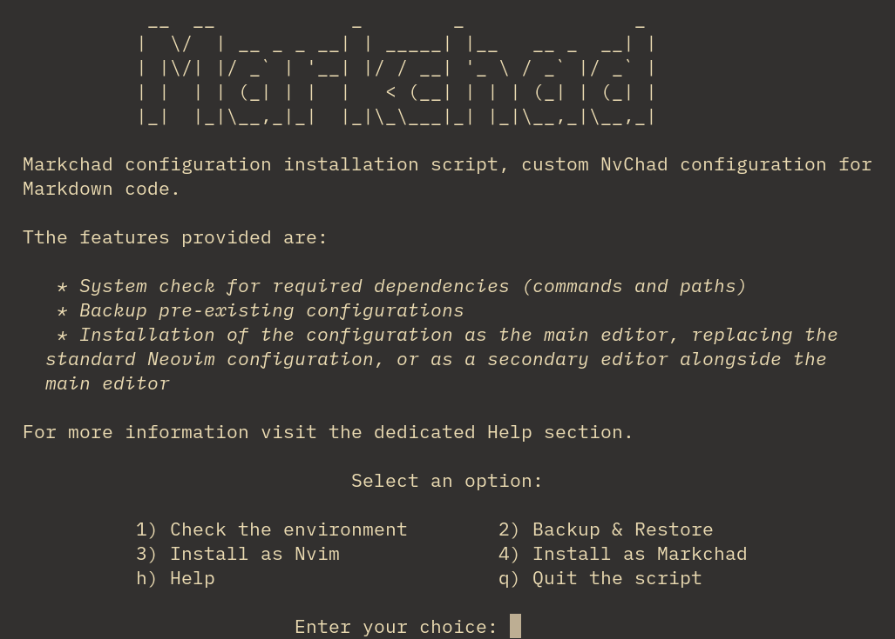

## Introduction

The Markchad configuration is distributed complete with all the files needed to run it, once installed it can be used immediately, the configuration files found in `~/.config/nvim` and the shared files in `~/.local/share/nvim` are provided.  
This solution provides a more stable package than a distribution with *Git*, so plugins, which by their nature are constantly being updated, can be carefully configured and tested before being included in the configuration to be distributed.  
The solution also makes it possible to distribute along with the configuration files the language servers (LSPs), linters and formatters necessary for the plugins to function.

## :material-cart-plus: Requirements

The configuration for its installation requires the same components required by NvChad, which are:

* *Neovim* 0.10
* A *Nerd Font* installed and configured in the terminal
* *git* installed in the system
* *GCC* and *Make*

For a more in-depth overview of the necessary components, consult the [NvChad installation](https://nvchad.com/docs/quickstart/install) page.

### :material-tray-plus: Additional requirements

The following components are also required for successful configuration:

* [npm](https://www.npmjs.com/) Used by *Mason* to install language servers
* [sqlite](https://sqlite.org/) (lightweight database) used by *yanky.nvim* to store copied strings
* [ripgrep](https://github.com/BurntSushi/ripgrep) (search tool) a line-oriented search tool
* [lazygit](https://github.com/jesseduffield/lazygit) an ncurses-style interface that allows you to perform all git operations in a more user-friendly way

#### Installation of additional packages

Installation of add-on packages in Rocky Linux comes from various sources. These procedures are:

!!! note

    The following commands assume that you are using the *root* account or have `sudo` privileges. If using `sudo`, append `sudo` to the command listed. 

The *sqlite* and *npm* packages are available in the official Rocky Linux repositories, so simply install them with the package manager:

```bash
dnf -y sqlite npm
```

For the installation of `ripgrep`, the EPEL repository is needed. A [dedicated section](https://docs.rockylinux.org/books/admin_guide/13-softwares/?h=#the-epel-repository) in the Administrator's Guide is available for an overview of the project.  
It involves executing the following commands:

```bash
dnf install epel-release
dnf update
dnf install  ripgrep -y
```

The last required package, `lazygit`, is not available in the official channels (Rocky Linux, EPEL), but installation from Fedora's [Repository Copr](https://copr.fedorainfracloud.org/) is possible with the commands:

```bash
dnf copr enable atim/lazygit -y
dnf install lazygit
```

## :material-monitor-arrow-down-variant: Installation

The installation of the configuration is fully automated, the entire process being handled by a bash script that provides the following functionality:

* Checking for availability of required packages and presence of existing configurations
* Backup and restore previous configurations
* Installation of the configuration
* Consultation of inline help

Specifically, the configuration can be installed following two distinct schemes:

1. As the main editor - this solution allows Markchad to be used with the standard Neovim command (nvim) and a possible launcher for the Gnome desktop, however, in this case all configuration files and shared data are removed, consequently it is recommended to back up the configuration before proceeding with the installation
2. As a secondary editor - in this case the Markchad configuration is installed separately and the whole process runs using the `markchad` folder as a reference. The *markchad* folder is used for configurations in `.config` and for shared data in `.local/share`, this allows you to continue using the basic version of Neovim for the other programming languages you are working on and Markchad for Markdown documents only.

### Download the script

The installation script is available at the following address:

```bash
curl -L https://github.com/ambaradan/markchad/releases/latest/download/install_markchad.tar.gz
```

Also download the checksum file (sha256):

```bash
curl -L https://github.com/ambaradan/markchad/releases/latest/download/install_markchad.tar.gz.sha256
```

Verify the integrity of the archive with:

```bash
sha256sum -c install_markchad.tar.gz.sha256 
install_markchad.tar.gz: OK
```

If everything is correct extract the archive and start the script with:

```bash
tar -xf install_markchad.tar,gz
cd install_markchad
./install.sh
```

The following screen will open from which you will carry out all the necessary operations to install the configuration:



Start with option 1 to verify that your system meets the requirements, the missing commands can be installed on a Rocky Linux system by following the suggestions displayed in the screen, for other linux systems they should be adjusted according to the package manager in use.

Once the requirements have been met, go to option 2 and make a backup copy of the *nvim* configuration; if Neovim has only been used in its basic version, no personal configuration will be present and this step can be skipped.

Then go on to install the configuration according to the scheme chosen from the two described above, the script at this point will take care of downloading the latest version of the release and checking its integrity, unzip the archive and copy the files to the desired location, at the end it will present a screen with the manual actions needed to finish it.

## :material-update: Configuration update

Updating the Markchad configuration consists of replacing, and subsequently deleting, the existing copy. It is therefore recommended to make a backup copy before proceeding with the upgrade.  
Deleting the configuration is necessary to ensure that the new installation runs properly, especially for the shared plugin data in the `.loca/share` folder.

To perform the upgrade, simply repeat the installation procedure provided by the installation script as described above; the script will detect the previous installation and take care of deleting it before proceeding with the new installation.

## :material-contain-end: Conclusions

The configuration is constantly evolving and tries to follow the development of the main plugins for writing markdown code. The author uses it daily, so it should be stable enough for use in *production*. Any kind of suggestions or corrections are welcome.
